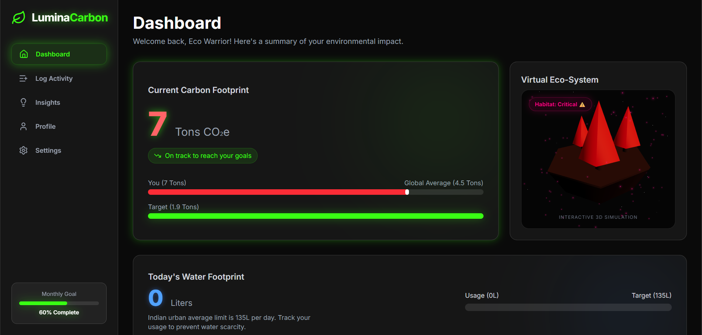
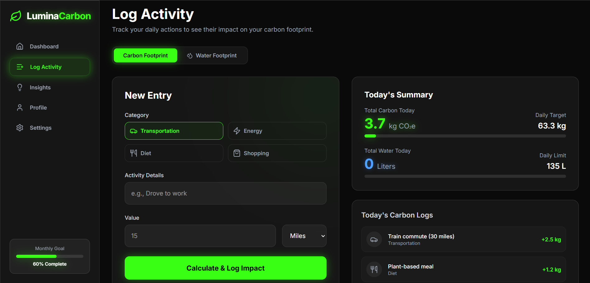
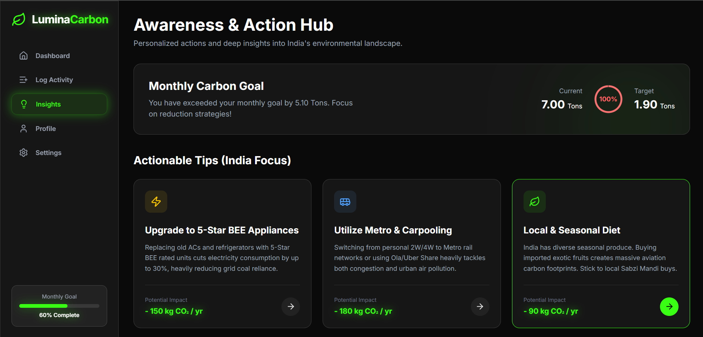
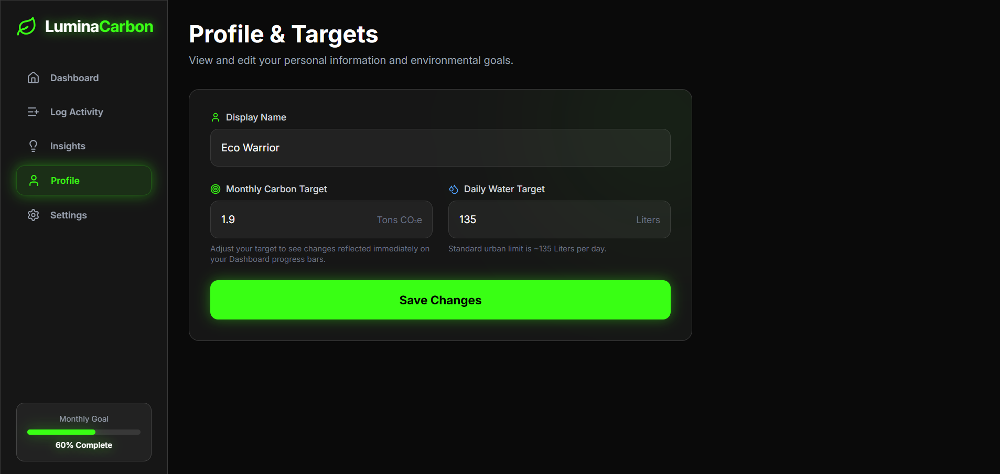

# 🌿 LuminaCarbon

LuminaCarbon is a modern, gamified carbon and water footprint tracking application. Designed with a sleek dark aesthetic, it empowers users to visualize their environmental impact in real-time through an interactive 3D **Virtual Eco-System** that thrives or decays based on your daily sustainability choices.

<p align="center">
  
  
  
  
</p>

## ✨ Key Features

- 🌍 **Virtual Eco-System:** A fully interactive 3D habitat built with `react-three-fiber` that dynamically reacts to your carbon score. Stay under your monthly target to keep the forest thriving, or watch it degrade if you exceed limits.
- 📊 **Carbon Footprint Tracking:** Log your daily transport, diet, energy, and shopping habits to see their precise CO₂e impact compared to the national average.
- 💧 **Water Footprint Tracking:** Monitor your daily water consumption against standard urban limits to prevent water scarcity.
- 💡 **Actionable Insights:** Get targeted, localized tips on how to reduce emissions (e.g., using 5-Star BEE appliances, metro rail commuting, and urban waste segregation).
- ⚙️ **Personalized Goals:** Customize your display name, monthly carbon limit, and daily water target directly from your profile.

## 🛠️ Tech Stack

- **Framework:** [Next.js](https://nextjs.org/) (React 19)
- **Language:** TypeScript
- **Styling:** Tailwind CSS (with custom Glassmorphism & Neon Glow UI)
- **3D Engine:** [Three.js](https://threejs.org/) & [@react-three/fiber](https://docs.pmnd.rs/react-three-fiber/getting-started/introduction)
- **Icons:** [Lucide React](https://lucide.dev/)

## 🚀 Getting Started

### Prerequisites
Make sure you have [Node.js](https://nodejs.org/) installed on your machine.

### Installation

1. **Clone the repository:**
   ```bash
   git clone https://github.com/codewithsathwik/LuminaCarbon.git
   cd LuminaCarbon
   ```

2. **Install dependencies:**
   ```bash
   npm install --legacy-peer-deps
   ```
   *(Note: `--legacy-peer-deps` is recommended due to React 19 compatibility with some 3D packages).*

3. **Run the development server:**
   ```bash
   npm run dev
   ```

4. **Open your browser:**
   Navigate to [http://localhost:3000](http://localhost:3000) to see the application in action.

## 📂 Project Structure

- `/src/app` - Next.js App Router pages (Dashboard, Log, Insights, Profile, Settings).
- `/src/components` - Reusable UI components including the `EcoHabitat` 3D simulation and `Sidebar`.
- `/src/context` - Global state management (`CarbonContext.tsx`) utilizing `localStorage` for data persistence.

## 🤝 Contributing
Contributions, issues, and feature requests are welcome! Feel free to check the [issues page](https://github.com/codewithsathwik/LuminaCarbon/issues) if you want to contribute.

## 📄 License
This project is open-source and available under the [MIT License](LICENSE).
